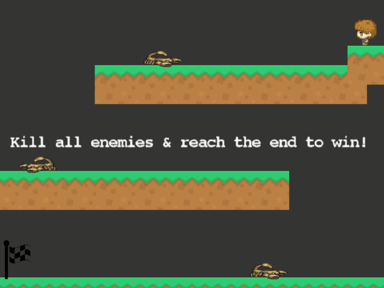

# Rise Of The AI!

A video game where you must navigate a platform world full of scorpions! Use the spacebar and left/right arrow keys in order to kill all the enemies by jumping on them. Reach the end to win, but make sure to not let yourself be stung!

## Previews of the game:

Failed Attempt:

Successful Attempt:

 

## Tools Used:

- Visual Studio

## How To Play

1. Have [Visual Studio](https://visualstudio.microsoft.com/) Downloaded
2. Clone repository to local machine and open project through visual studio
3. Once Visual Studio is opened, run the program by pressing the Green "Play" Button, usually has the words "Local Windows Debugger" next to it.
